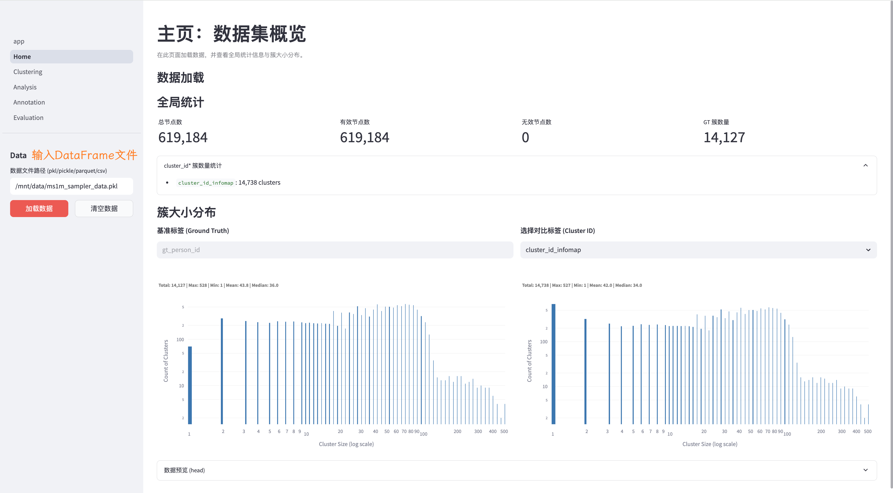
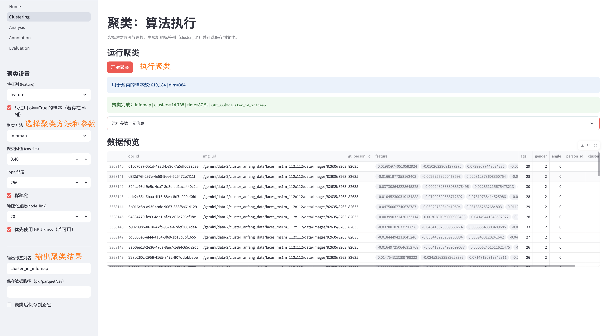
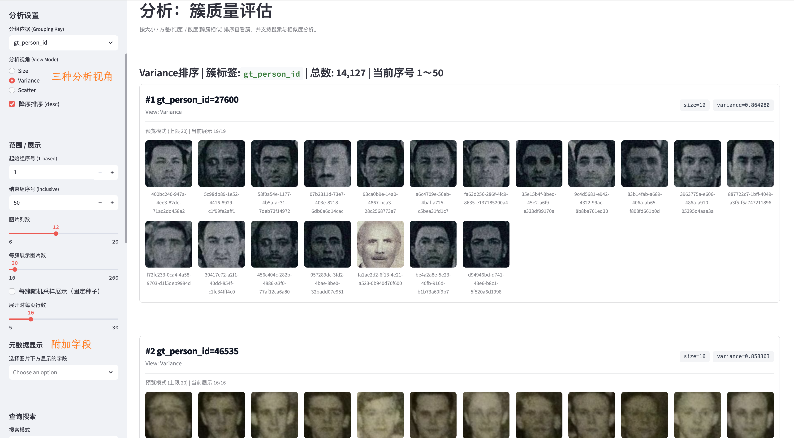
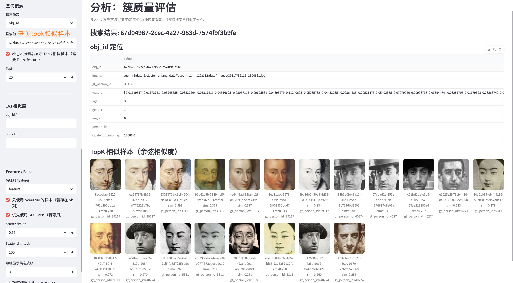
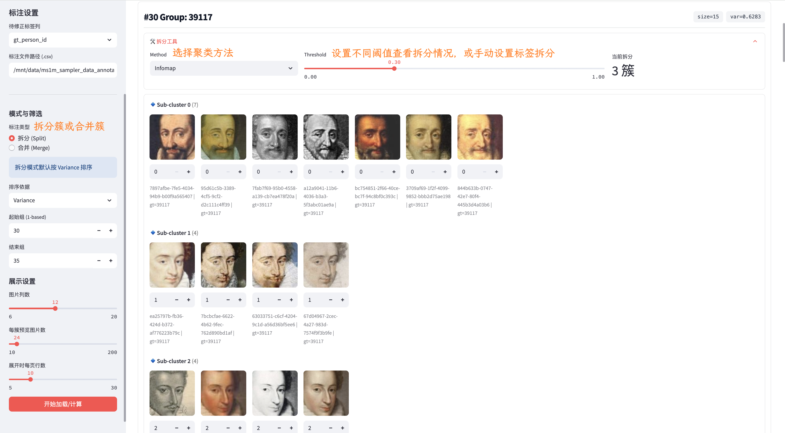
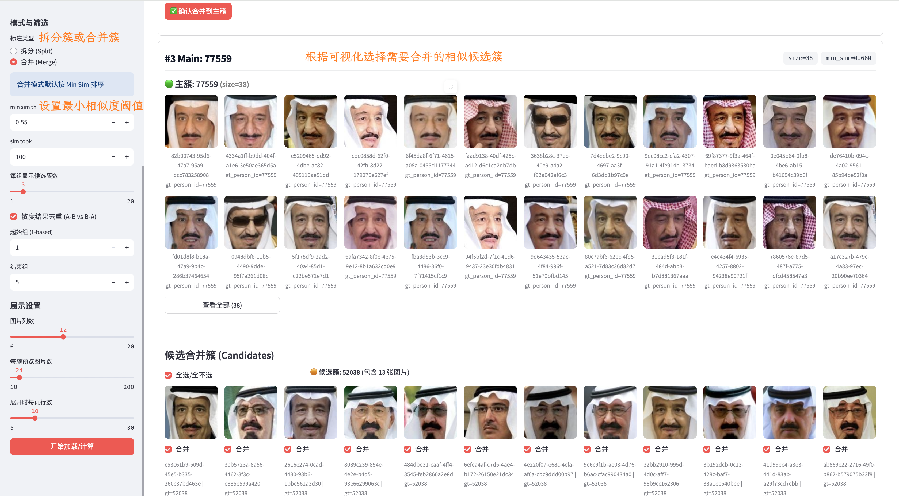
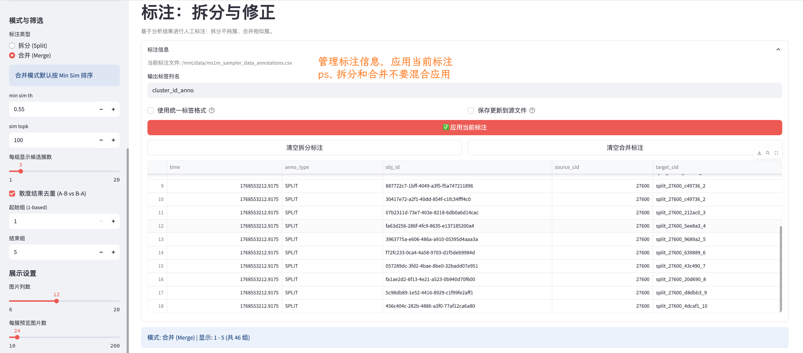
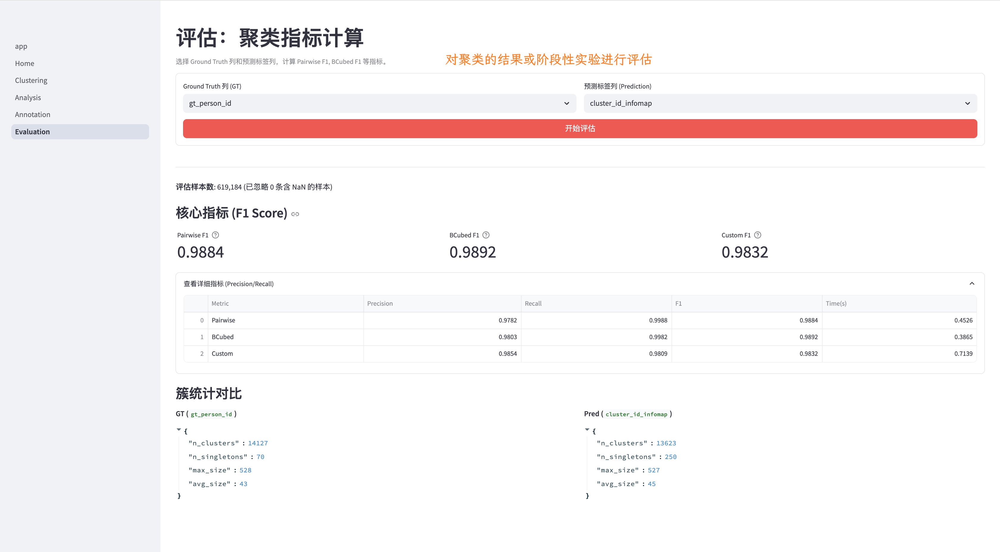

# ClusterFlow 使用说明

本文档将详细介绍**ClusterFlow**各个模块的功能与使用方法。以下使用为ms1m采样数据作为示例。

## 1. Home (主页与数据加载)

**功能**：加载数据文件，进行字段校验，并查看数据集的全局统计信息。

  

### 操作步骤
1.  **输入路径**：在侧边栏输入数据文件的绝对路径（支持 `.pkl`, `.parquet`, `.csv`）。
2.  **加载数据**：点击“加载数据”按钮。系统会自动校验 `obj_id`, `img_url` 等必需字段。
3.  **查看概览**：
    *   **全局统计**：查看总样本数、有效/无效样本数(ok字段，可选)、GT 簇数量。
    *   **簇大小分布**：直方图展示簇规模分布。
    *   **数据预览**：查看 DataFrame 前几行数据。

## 2. Clustering (聚类执行)

**功能**：配置参数并运行聚类算法，生成新的标签列。

### 支持算法
*   **HAC (层次聚类)**：通过并查集合并高相似度邻居。
*   **Infomap**：基于图论的社群发现算法， 推荐聚类算法。
*   **KMeans**：经典的划分式聚类，支持 Faiss GPU 加速。

### 操作说明
1.  **选择方法**：在侧边栏选择聚类算法（如 `HAC`）。
2.  **设置参数**：
    *   `阈值 (Threshold)`：相似度阈值（Cosine Similarity）。
    *   `TopK`：构建 KNN 图时的邻居数量。
3.  **运行**：点击“开始聚类”。
4.  **保存**：聚类完成后，结果会写入内存中的 DataFrame。勾选“聚类后保存”可将结果持久化到文件。

## 3. Analysis (可视化分析)

**功能**：多维度排序查看聚类结果，发现问题簇。

### 3.1 排序视角
*   **Size (大小)**：按簇内样本数降序排列，快速查看头部大簇。
*   **Variance (方差)**：按簇内特征方差降序排列。方差大意味着簇内样本差异大（即“不纯”），可能混入了不同人。
*   **Scatter (散度/跨簇相似)**：寻找最应该合并的簇对。计算每个簇与外部簇的最小相似度(可自定设置相似度阈值)，值越高说明可能发生了过度拆分。

### 3.2 可视化展示
可根据3.1的不同视角进行可视化。

  

*   **网格视图**：展示簇内图片，支持分页查看超大簇。
*   **元数据显示**：图片下方可配置显示 `obj_id`, `属性` 等附加信息。

### 3.3 检索与比对
*   **TopK 搜索**：输入 `obj_id`，利用 Faiss 实时检索全库最相似的 TopK 图片。
    

      
    

*   **1v1 比对**：输入两个 `obj_id`，直接计算余弦相似度。
    

      
    

## 4. Annotation (人工标注)

**功能**：对分析中发现的问题簇进行人工修正（拆分或合并）。

### 4.1 拆分模式 (Split)
针对不纯的簇（Variance 排序）。
1. 选择待修正的簇标签列。
2. 进入 **拆分 (Split)** 模式。
3. 选择聚类方法簇内聚类。
4. 人工确认子簇归属，点击“确认拆分”。
    

      
    

### 4.2 合并模式 (Merge)
针对“过度拆分”的簇（Scatter 排序）。
1. 进入 **合并 (Merge)** 模式。
2. 设置对应的相似度阈值。
2. 计算列出主簇（Main）及其高相似候选簇（Candidates）。
3. 勾选属于同一人的候选簇，点击“合并到主簇”。
    

      
    

    

### 4.3 结果应用

*   标注操作会记录在 CSV 文件中。
*   点击“应用当前标注”可将修正结果回填到 DataFrame 的新列中（如 `cluster_id_corrected`）。

## 5. Evaluation (指标评估)

**功能**：计算聚类质量指标，对比 GT 与预测结果。

### 核心指标
*   **Pairwise F1**：基于成对（Pair）关系的准确率与召回率调和平均，关注“两张脸是否被正确分到一组”。
*   **BCubed F1**：基于每个元素的加权精度/召回率，更符合直观感受，对簇大小分布不敏感。

### 统计对比
*   对比 GT 与 预测结果的簇数量、单体簇（Singletons）数量、最大/平均簇大小等统计信息。

---

## 附录：部分补充说明

### 散度分析 (Scatter Analysis)
用于发现**过度拆分（Over-clustering）**的问题。
1. 对全量数据构建 Faiss 索引。
2. 对每个样本，搜索其 TopK 邻居。
3. 如果邻居属于不同的簇（`label_i != label_j`）且相似度 `sim > threshold`，则记录一条“跨簇边”。
4. 汇总每个簇的跨簇边，找到与其连接最紧密的“候选簇”。
5. 按“最小相似度”（Group Min Sim）排序，相似度越高的簇对，越有可能是同一个人的不同簇，建议合并。

### 关于标注

**「注意」** 标注需要交替应用，避免造成拆分和合并一起应用造成标签混乱。